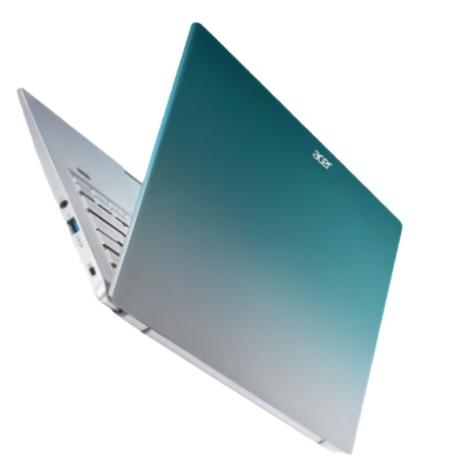
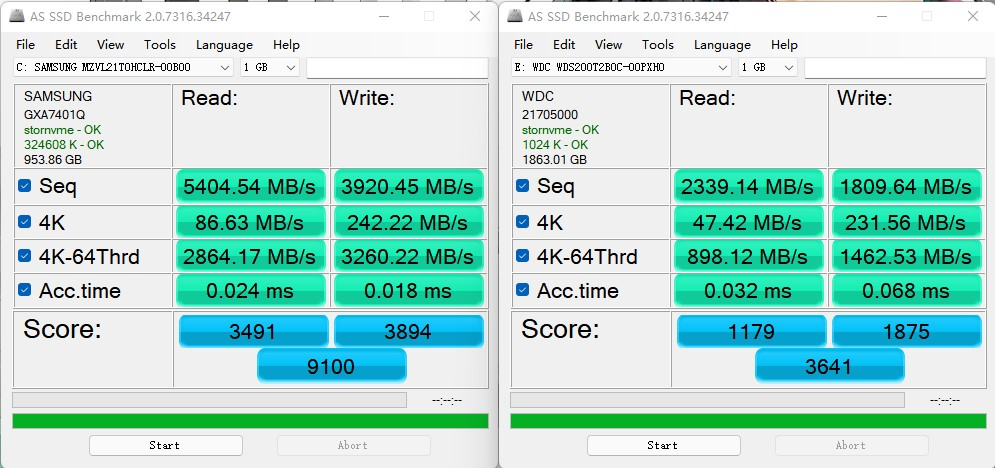

2022年新生购机指南

**参与人员：**

>   选购指导：杨昕昱、劳家康

>   机型推荐：唐思琪、王梓铜、钟大柯、苏菁华、程一木、蔺佳骏、王浩楠、谷佳熠

>   审核校对：葛煜龙、胡景琪、王永琪、姚嘉

>   特别鸣谢 社团指导老师与多位前辈 在指南编写过程中的建设性意见

**更新日志：**

>   20220411：完成了Part Ⅰ、Ⅱ、Ⅲ部分的更新

>   20220418：完成了对于以上部分的校对

>   20220507：完成了测试版Ver0.21

>   20220523：开始更新近期的新品

>   20220527：更新完毕、排版完成

>   20220528：进行了文字上的纠错

>   20220601：进行内容的重新排版

# Part Ⅰ 前言

在2021年夏季，我们为大家撰写了2021年的新生购机指南，并得到了广泛的传播，截止目前，仅义诊群和购机群中各版本购机指南的下载量就已突破5700人次，为我校甚至是其他学校的广大师生们的购买决策提供了重要参考。如今，一年的时间过去，笔记本电脑市场的格局又迎来了深刻的变化，原本于2021年编写的购机指南已不再具有时效性，故在此进行年度更新。若同学你在阅读本指南的过程当中有任何疑问，欢迎你加入购机帮扶群：511624299，我们会为你作出合适的推荐。

# Part Ⅱ 如何阅读本指南

  
查看本指南时，手机请使用WPS或Microsoft Office打开，不要用QQ直接看；电脑可以使用Acrobat,Edge等软件打开。本指南中蓝字为超链接，均可点击。  
**手机使用WPS打开的方法：**

\*\*  
\*\*

**目录示意：**

**点击页面左下角快速返回目录：**

**点击机型列表跳转至详情：**

**具体机型推荐示意：**

# Part Ⅲ 选购笔记本的基本流程

**1.确定需求**

请仔细思考自己的学习与游戏需求，判断自己所需的硬件配置。目前笔记本的CPU性能基本无法构成瓶颈，一般情况下只需关注其搭载的显卡。具体选择建议详见[笔记本电脑的选择部分](#_笔记本电脑的选择)

**2.确定预算范围**

笔记本更新换代较快，请不要盲目攀比，过分追求性能。请在自己能够承受的预算范围内购买。

**3.挑选机型**

挑选机器时可以参考以上几个维度进行挑选

**点击本指南目录**即可直达对应机型的详细介绍（点击详情页面左下角可以返回目录）。我们将推荐的笔记本分为**轻薄本**与**性能本**两类，并**按照价格从低到高排序**。

详细介绍中总结了该机器在同价位中的优缺点，可根据自身需求比较购买（在确认性能需求后主要比较颜值与做工，便携性，屏幕，拓展性，品牌与售后），具体评价标准请参见评价体系部分。**对于看不懂的名词与概念，**[**评价体系部分**](#_Part_Ⅲ_笔记本电脑的评价体系)**有详细介绍**。

同时我们按照需求将推荐机器进行了简单汇总，可点击下表对应机器查看详细评测：

| 机型推荐                         |                                                             |                                                                             |                    |       |                                                                          |
|----------------------------------|-------------------------------------------------------------|-----------------------------------------------------------------------------|--------------------|-------|--------------------------------------------------------------------------|
| 需求                             | 名称                                                        | 配置                                                                        | 参考价格           | 简评  |                                                                          |
| 专业                             | 游戏                                                        |                                                                             |                    |       |                                                                          |
| 无建模、渲染需求                 | CSGO,LOL等网游；原神中低画质60FPS；GTA5、饥荒等早期单机游戏 | [惠普 战66](#轻薄本惠普-战66)                                               | R5-5625U           | 4299  | 续航，噪音表现较好，拓展性极佳；性能较弱                                 |
|                                  |                                                             | [宏碁非凡s3 2022](#轻薄本宏碁-非凡s3)                                       | i5-1240P           | 4199  | 性价比高；屏幕，拓展性很好                                               |
|                                  |                                                             | [华硕无双15](#轻薄本华硕-无双15)                                            | i5-12500H          | 5199  | OLED屏；除屏幕外其他方面略差                                             |
|                                  |                                                             | [机械革命无界16](#轻薄本机械革命-无界16)                                    | i7-12700H          | 5299  | 屏幕、性能、拓展性优秀；品控，售后不是很好                               |
|                                  |                                                             | [联想 Thinkbook14+](#轻薄本联想-thinkbook14)                                | i5-12500H          | 5299  | 屏幕、性能、拓展性优秀；续航一般                                         |
|                                  |                                                             | [惠普 战X](#轻薄本惠普-战x-13)                                              | R5-6600U           | 5299  | 键盘手感、续航、噪音控制、外部拓展性优秀；性能一般                       |
|                                  |                                                             | [荣耀MagicBook 14](#轻薄本荣耀-magicbook-14)                                | i5-12500H          | 4999  | 续航、性能、键盘手感优秀；拓展性较差                                     |
|                                  | 原神中高画质60FPS；中特效吃鸡、apex；部分3A作品中低特效     | [红米 RedmiBook Pro 15 锐龙版](#轻薄本红米-redmibook-pro15-锐龙版)          | R7-6800H           | 5299  | 性价比高；屏幕极佳，性能、续航优秀；硬盘素质、拓展性较差                 |
|                                  |                                                             | [联想 小新Pro16 锐龙版](#轻薄本联想-小新pro16-锐龙版)                       | R7-6801H           | 5446  | 性价比高；屏幕、性能、续航优秀；拓展性较差；偏重                         |
| 中度建模、渲染需求               |                                                             | [联想 Thinkbook14+](#轻薄本联想-thinkbook14)/[16+](#轻薄本联想-thinkbook16) | i5-12500H +RTX2050 | 6299  | 屏幕、性能、拓展性优秀；续航一般                                         |
|                                  |                                                             | [荣耀MagicBook 14](#轻薄本荣耀-magicbook-14)                                | i5-12500H +RTX2050 | 6699  | 续航、性能、键盘手感优秀；拓展性较差                                     |
|                                  |                                                             | [宏碁 暗影骑士擎 2022](#性能本宏碁-暗影骑士擎)                              | i5-12500H +RTX3050 | 5799  | 性价比较高；入门级的性能本                                               |
| 重度建模、渲染需求；剪辑视频需求 | 1080P下畅玩绝大多数游戏                                     | [宏碁 暗影骑士擎 2022](#性能本宏碁-暗影骑士擎)                              | i7-12700H +RTX3060 | 7699  | 性价比高；性能强；屏幕优秀；拓展性优秀；噪音尖锐                         |
|                                  |                                                             | [华硕天选3](#性能本华硕-天选3)                                              | R7-6800H +RTX3060  | 7499  | 性能强；还算轻薄；屏幕一般；噪音较大                                     |
|                                  |                                                             | [惠普 暗影精灵8Pro](#性能本惠普-暗影精灵8pro)                               | i7-12700H +RTX3060 | 7999  | 性价比高；性能强；一线品牌售后优秀；键盘温度较低；方向键半高             |
|                                  |                                                             | [联想Y9000P](#性能本联想-拯救者-y9000p)                                     | i7-12700H +RTX3060 | 8999  | 偏贵；屏幕优秀；性能强；135W PD充电；一线品牌售后优秀；不易抢购          |
|                                  |                                                             | [ROG魔霸新锐](#性能本rog-魔霸新锐)                                          | R9-6900HX +RTX3060 | 8999  | 双显三模；性能强；屏幕优秀；信仰灯；无摄像头；方向键半高                 |
|                                  |                                                             | [ROG幻14](#性能本rog-幻14)                                                  | R7-6800HS +RX6700S | 11499 | 光显矩阵屏；便携性好；性能还不错；屏幕优秀；高负载下噪音大；不便拓展内存 |
|                                  |                                                             | [ROG幻16](#性能本rog-幻16)                                                  | i7-12700H +RTX3060 | 9999  | 便携性好；性能还不错；屏幕优秀；高负载下噪音大；不便拓展内存             |

**关于去年的机型：本指南只对近期推出的新机型进行评测**（主要为12代酷睿以及6000系锐龙），不少去年的产品性价比较高，亦可在低价促销时购买（主要渠道为拼多多百亿补贴），但不建议在非京东自营平台购买搭载3060显卡的机器（容易存在矿机回流）。如有此方面购机需求可以进群咨询。

**4.购买**

（1） 去哪买

点击本指南机型[详细介绍](#_Part_Ⅳ_具体机型推荐)后的链接即可直达京东自营页面（推荐使用电脑或手机WPS，手机QQ内无法直接打开链接），非常不建议更改所选配置。

若自行购买，可按照以下优先顺序购买

**a.首选京东自营！！！**

Tips:注意分辨京东自营

b.品牌官网、天猫官方旗舰店

c.华为授权体验店、小米之家等品牌线下直营店（电脑城不属于此类）

**不要在非官方实体店铺买电脑！ 不要在非官方实体店铺买电脑！ 不要在非官方**

**实体店铺买电脑！**

d.拼多多百亿补贴

-   
-   

（2） 怎么买

笔记本电脑经常促销，价格波动较大，我们根据近期价格曲线总结出了该机器值得入手的**参考价格**（一般在一个月以内能够达到的促销价格）

可以**根据自身需求结合当前价格与参考价格购买**，购机帮扶群中管理员也会推送近期值得入手的机器，请注意关注。

部分热门机型存在缺货情况，一般可以**看准促销或秒杀开始时间，卡点读秒抢购**。若仍然无法抢到，可以考虑**前往品牌官网或天猫官方店购买**，或者**选择同价位其他机型**。

**其他：**

对于电脑感兴趣的同学，想要深入了解笔记本选购相关知识，可以详细阅读前言部分

有任何不明白的问题欢迎加入购机帮扶群：511624299 友好讨论，我社只对群中管理员的言论负责，请注意分辨！另外切勿私聊管理员，有问题请在群中与大家一起交流。

# Part Ⅲ 具体机型推荐

欢迎同学你来到了我们的具体机型推荐环节！在这一环节当中，我们将会列出我们认为比较值得推荐的笔记本机型及它们的对应配置，不过考虑到一款机型模具可以对应多种配置，为方便同学你的阅读，我们将会列出我们主推荐的配置及我们对此的评价，同时给出次推荐配置所对应的价格与购买链接。同时需要同学你注意的是，在主要参数项目当中，质量将会优先采用实际测试值，厚度将采用最厚值及最薄值的平均值，因此可能会与厂商标注的参数有所不同，请你谅解。

\*\*  
\*\*

## 【轻薄本】宏碁 非凡S3

**主要参数**

| 项目     | 参数                             |
|----------|----------------------------------|
| 尺寸     | 14.5寸                           |
| 质量     | 1.25kg                           |
| 厚度     | 16.6mm                           |
| 处理器   | i5-1240P                         |
| 显卡     | Xe集成显卡                       |
| 存储     | 16G LPDDR4X-4266MHz + 512G       |
| 屏幕     | 2560x1440；100%sRGB高色域；60Hz  |
| USB接口  | USB-A：5Gb/s x2；USB-C：雷电4 x2 |
| 影音接口 | HDMI2.0；耳麦孔                  |
| 其他接口 | 无                               |
| 充电接口 | 65W PD电源接口                   |

**价格&购买链接**

主推荐：i5-1240P 16G+512G ￥4299

[京东自营链接](https://item.jd.com/100020236289.html)

**我们的评价**

**优点：**

1.  性价比极高，是四千元价位段中难得的好机器，所有对它的批评都应考虑到这一事实。
2.  在具有良好性能释放的同时，高负载下的风扇噪音较低，键盘温度较低，调教非常到位。
3.  虽然是入门机型，但是接口的数量和质量上都相当出色，两个雷电4更是给用户意外惊喜。
4.  内部支持双M.2硬盘的安装，且空余的硬盘位也是2280规格，速率最大为PCIE4.0x4。

**缺点：**

1.  屏幕使用的雾面屏膜不够通透，显示有油腻感。
2.  硬盘型号为Micron 2450，缓外速度相当拉胯，不过可以理解。

**总结：**

如果说高端产品体现的是一个厂商的技术实力，那么入门产品体现的则是厂商的供应链控制能力和良心。出乎我们的预测，新款非凡S3不仅更换了新一代处理器，还充分考虑到了广大用户的使用实际，在屏幕、拓展性、性能释放上做出了巨大的升级，虽然该机器的屏幕仍然存在有观感油腻的现象，原装固态硬盘也有阉割，但是在这样的价格面前，这些都变得不重要了，事实上，就算这台机器卖到4499甚至4599，它也依然值得消费者购买。

## 【轻薄本】惠普 战66

**主要参数**

| 项目     | 参数                              |
|----------|-----------------------------------|
| 尺寸     | 14.5寸                            |
| 质量     | 1.38kg                            |
| 厚度     | 19.9mm                            |
| 处理器   | R5-5625U                          |
| 显卡     | Vega集成显卡                      |
| 存储     | 16G DDR4-3200MHz + 512G           |
| 屏幕     | 1920x1080；100%sRGB高色域；60Hz   |
| USB接口  | USB-A：5Gb/s x3；USB-C：10Gb/s x1 |
| 影音接口 | HDMI2.0；耳麦孔                   |
| 其他接口 | RJ45网口                          |
| 充电接口 | 65W DC电源接口                    |

**价格&购买链接**

主推荐：R5-5625U 16G+512G ￥3999

[京东自营链接](https://item.jd.com/100032226552.html)

次推荐：i5-1240P 16G+512G ￥4299

[京东自营链接](https://item.jd.com/100020480561.html)

**我们的评价**

**优点：**

1.  在性能释放足够日常使用的同时，风扇噪音也依然较小，而且拥有非常长的续航时间。
2.  内外拓展性都相当强大，能应付绝大多数用户在办公时的拓展需求。

**缺点：**

1.  机身开了指纹识别模块的孔位，却没有指纹识别功能。
2.  屏幕边框依然较同类产品较粗，颜值上稍逊一筹。
3.  额外硬盘位为2242规格，使得用户升级成本增高。

**总结：**

战66一直拥有良好的内外部拓展性和续航时长，是一款典范级的办公、学习机器，也正因如此，苛责战66的屏幕分辨率和性能释放是不合适的。今年新款的战66中，我们更推荐锐龙版，理由有二：一是虽然锐龙版依然搭载的是锐龙5000系列处理器，但是反过来思考，倘若其搭载了锐龙6000系列，新处理器及全新规格的内存必然将使其日常售价提高至5599甚至更高；二是第12代酷睿处理器在性能大幅提升的同时，其待机功耗实际要比锐龙5000系列处理器高许多，作为办公本来说并不是那么合适。但总体而言，对于绝大多数的老师和同学来说，他们其实并不需要这么极限的续航时间，因此，我们更建议你选择其他型号的机器。

## 【轻薄本】联想 ThinkBook14+

**主要参数**

| 项目     | 参数                                                      |
|----------|-----------------------------------------------------------|
| 尺寸     | 14.5寸                                                    |
| 质量     | 1.45kg                                                    |
| 厚度     | 17.1mm                                                    |
| 处理器   | i5-12500H                                                 |
| 显卡     | Xe集成显卡                                                |
| 存储     | 16G LPDDR5-4800MHz + 512G                                 |
| 屏幕     | 2880X1800；100%sRGB广色域；90Hz                           |
| USB接口  | USB-A：5Gb/s x2、480Mb/s x1；USB-C：雷电4 x1；10Gb/s x1； |
| 影音接口 | HDMI2.0；耳麦孔                                           |
| 其他接口 | RJ45网口；microSD读卡器                                   |
| 充电接口 | 100W PD电源接口                                           |

**价格&购买链接**

主推荐：i5-12500H 16G+512G ￥4999

[京东自营链接](https://item.jd.com/100020078921.html)

次推荐：i5-12500H+RTX2050 16G+512G ￥6299

[京东自营链接](https://item.jd.com/100035250898.html)

**我们的评价**

**优点：**

1.  屏幕素质在同尺寸同价位的产品中处于优秀水准。
2.  外部接口数量充足，内部支持双M.2硬盘的安装，相当实用。

**缺点：**

1.  作为商务机型，没有对外出携带时的续航做优化，导致续航能力较上代有所下降。

**总结：**

在去年，联想的ThinkBook14P向用户证明了商务本也可以有强大的性能释放，而今年的ThinkBook14+在此基础上还做了进一步的优化，在提高处理器散热设计功耗的同时，外部新增一个USB-A接口，内部新增了一个2280规格的M.2硬盘位，可以说联想的设计者已经考虑到了绝大多数轻薄本用户的实际需求，做出了一台几乎完美的机器，这也难怪这台机器在首发之后价格不断上涨了。不过，我们认为唯一的槽点就是ThinkBook14+作为商务本，在知晓第12代酷睿处理器低负载耗电量增加的情况下，并没有针对用户外出的情景做续航优化，导致该机续航能力较去年的ThinkBook14P有明显下降。不过这样的缺点对于绝大多数同学来说是微不足道的，实在在意的同学也可以购买对应的100W便携PD充电器解决这一问题。

## 【轻薄本】荣耀 MagicBook 14

**主要参数**

| 项目     | 参数                              |
|----------|-----------------------------------|
| 尺寸     | 14.5寸                            |
| 质量     | 1.56kg                            |
| 厚度     | 16.4mm                            |
| 处理器   | i5-12500H                         |
| 显卡     | Xe集成显卡                        |
| 存储     | 16G LPDDR5-4800MHz + 512GB        |
| 屏幕     | 2160x1440；100%sRGB高色域；60Hz   |
| USB接口  | USB-A：5Gb/s x1；USB-C：10Gb/s x2 |
| 影音接口 | HDMI2.0；耳麦孔                   |
| 其他接口 | 无                                |
| 充电接口 | 100W PD电源接口                   |

**价格&购买链接**

主推荐：i5-12500H 16G+512G ￥4999

[京东自营链接](https://item.jd.com/100038962384.html)

**我们的评价**

**优点：**

1.  有着接近70W的性能释放，毫无疑问是同尺寸轻薄本中的翘楚。
2.  虽然机身在同尺寸机型当中略重，但是电池容量高达75Wh，很好。
3.  OS Turbo驱动级别的性能调度优化方案，使得该机续航比同类机型长很多。
4.  MagicBook系列产品有着良好的生态联动，非常适合日常的学习办公场景。
5.  附送的是100W的氮化镓充电器，外出便携性得以进一步地提升。

**缺点：**

1.  接口数量较少，其实完全可以配备第二个USB-A接口。

**总结：**

在今年的市场上，搭载12代酷睿处理器的轻薄本其实一直面临着一个痛点，那就是续航时间过短。正因如此，MagicBook14无疑是一款出人意料的产品，其在实现强大性能释放的同时，还通过OS Turbo驱动级别的智能性能调度大幅度地延长了整机的续航时间，甚至荣耀还为这台机器附送了一个100W的氮化镓充电器，诚意十足，即便不是荣耀生态的用户，这台机器也相当值得。不过稍显可惜的就是荣耀没有为这台机器配置更多的USB-A接口，使得整机的外部拓展性稍差。

## 【轻薄本】华硕 无双15

**主要参数**

| 项目     | 参数                                         |
|----------|----------------------------------------------|
| 尺寸     | 15.6寸                                       |
| 质量     | 1.87kg                                       |
| 厚度     | 18.8mm                                       |
| 处理器   | i5-12500H                                    |
| 显卡     | Xe集成显卡                                   |
| 存储     | 16G DDR4-3200MHz + 512G                      |
| 屏幕     | 2880x1620；100%DCI-P3广色域；120Hz           |
| USB接口  | USB-A：5Gb/s x1、480Mb/s x1；USB-C：雷电4 x2 |
| 影音接口 | HDMI2.0；耳麦孔                              |
| 其他接口 | 无                                           |
| 充电接口 | 90W AC电源接口                               |

**价格&购买链接**

主推荐：i5-12500H 16G+512G 15寸 ￥4999

[京东自营链接](https://item.jd.com/100035259546.html)

**我们的评价**

**优点：**

1.  搭载了一款素质极高的OLED屏幕，其屏幕素质在万元以内的产品中都难逢敌手。
2.  搭载了两个雷电4接口，方便用户外接如NVME移动硬盘盒、显卡坞这样的高速设备。

**缺点：**

1.  键盘没有背光，如此设计的逻辑实在是令人费解。
2.  机器在高负载下的风扇噪音较大，实际上完全可以将转速调低一些，这有待后续优化。
3.  硬盘型号为Micron 2450，缓外速率相当拉胯，且没有额外的M.2接口让用户加装硬盘。
4.  虽然华硕针对OLED屏幕的烧屏缺陷做了相应优化，但是其结果如何有待未来长期观察。

**总结：**

无双15作为一款大屏轻薄本，在保有良好的性能释放以及外部拓展性的同时，在五千元价位段搭载了一块素质极高的OLED屏幕，这样差异化的设计确实能够戳中许多办公用户的需求。但是，OLED也存在有一些缺陷，其中最主要的就是烧屏问题，尽管华硕声称他们的工程师已经对此做了对应优化，但是考虑到许多老师同学在购买笔记本电脑后往往会使用四年甚至六至七年，这些优化能否使OLED的屏幕素质保持如此之长的时间，依然有待后续观察；其次，OLED屏幕的成本问题始终是需要考虑的，无双15没有键盘背光，固态硬盘素质存在阉割，对此最合理的解释就是厂商想要尽可能地节省成本。因此，我们只推荐那些对于屏幕素质有极高追求的用户选择此产品。

## 【轻薄本】机械革命 无界16

**主要参数**

| 项目     | 参数                              |
|----------|-----------------------------------|
| 尺寸     | 16.1寸                            |
| 质量     | 1.73kg                            |
| 厚度     | 16.6mm                            |
| 处理器   | i7-12700H                         |
| 显卡     | Xe集成显卡                        |
| 存储     | 16G DDR4-3200MHz + 512G           |
| 屏幕     | 2560x1600；100%sRGB高色域；120Hz  |
| USB接口  | USB-A：5Gb/s x3；USB-C：10Gb/s x2 |
| 影音接口 | HDMI1.4；耳麦孔                   |
| 其他接口 | 无                                |
| 充电接口 | 90W DC电源接口                    |

**价格&购买链接**

主推荐：i7-12700H 16G+512G ￥5299

[京东自营链接](https://item.jd.com/100018385485.html)

次推荐：i7-12700H+RTX2050 16G+512G ￥5999

[京东自营链接](https://item.jd.com/100020236291.html)

**我们的评价**

**优点：**

1.  性价比极高，是五千元价位段少有的大屏高性能轻薄本。
2.  屏幕素质非常出色，其尺寸、分辨率、色域、刷新率、亮度等参数上都是同价位搭载IPS屏的产品中少有的。
3.  搭载了DDR4规格内存且支持更换，同时支持双M.2硬盘的安装，拥有超高内部拓展性，在轻薄本中尤为难得。

**缺点：**

1.  硬盘型号为Intel 660P，其素质与市场上同价位产品搭载的硬盘仍然存在较大的差距。
2.  性能释放的调教依然偏于保守，事实证明该机完全可以压制比55W更高的处理器功耗。
3.  机械革命并非一线厂商，品控及售后相对于一线厂商存在相当的差距。

**总结：**

无界16这款产品实际上是CODE10的精神续作。相比于前代，无界16青出于蓝而胜于蓝，在保持高性能释放和内部拓展性的同时还增加了接口数量，再加上机械革命的性价比优势，无界16几乎是你能在五千元价位段买得到的唯一一款搭载i7-12700H处理器的大屏高性能轻薄本，从这一角度来看，无界16是相当值得肯定的好产品。但是，虽然该机的硬盘相较于前代搭载的威刚硬盘有所升级，但与同价位的主流产品相比仍然存在较大的差距；而且令人感到惋惜的是机械革命并没有完全发挥这款模具的散热潜力，无界16的模具完全有压制70W甚至更高功耗的能力，而不是现在标定的55W。不过瑕不掩瑜，倘若同学你对于笔记本电脑的处理器性能释放有要求，无界16毫无疑问是值得你考虑的。

## 【轻薄本】惠普 战X 13

**主要参数**

| 项目     | 参数                              |
|----------|-----------------------------------|
| 尺寸     | 13.3寸                            |
| 质量     | 1.30kg                            |
| 厚度     | 19.2mm                            |
| 处理器   | R5-6600U                          |
| 显卡     | Radeon集成显卡                    |
| 存储     | 16G DDR5-4800MHz + 512GB          |
| 屏幕     | 1920x1080；100%sRGB高色域；60Hz   |
| USB接口  | USB-A：5Gb/s x2；USB-C：40Gb/s x2 |
| 影音接口 | HDMI2.0；耳麦孔                   |
| 其他接口 | 无                                |
| 充电接口 | 65W AC电源接口                    |

**价格&购买链接**

主推荐：R5-6600U 16G+512G ￥5299

京东自营链接

次推荐：R7-6800U 16G+512G ￥5799

京东自营链接

**我们的评价**

**优点：**

1.  作为一款13寸的机型，外部接口的数量和质量都非常出色。
2.  屏幕比例升级为16:10比例，亮度升级至400nit，更能满足用户办公时的需求。
3.  依然保持了经典的CNC一体成型的机身工艺，有着非常好的质感和机身强度。
4.  搭载锐龙6000系列处理器，续航能力非常强。

**缺点：**

1.  在质量上没有同14寸版本的质量拉开差距，存在优化的空间。
2.  与前代相比不再支持内存拓展，有些遗憾。

**总结：**

从惠普的宣传可以看出，新战X系列的定位已经彻底变为了搭载锐龙处理器的长续航本。而在此之中，13寸的版本尤为亮眼，一方面，新款的战X搭载了锐龙6000系列处理器，配合其搭载的低功耗屏幕，有着更加亮眼的续航表现；另一方面，新战X的两个USB-C接口全部支持USB4协议，数据传输速率高达40Gb/s，非常好。不过有得必有失，新战X的13寸版本并不再像前代那样支持内存拓展，这对一部分用户来说是一个坏消息；而且13寸版本在重量上并没有比即将上市的14寸版本轻盈太多。总之，如果说战66在机身的质感和续航上仍然存在一定的遗憾，那么战X可以说是尽可能地补齐了这些短板，甚至可以说其性价比完全可以战胜市场上同定位的ThinkPad X13。假如同学你对于笔记本的性能要求并不高，而且对于笔记本的质感有一定追求，相信你会喜欢上新款战X。

## 【轻薄本】红米 RedmiBook Pro15 锐龙版

**主要参数**

| 项目     | 参数                              |
|----------|-----------------------------------|
| 尺寸     | 15.6寸                            |
| 质量     | 1.77kg                            |
| 厚度     | 16.9mm                            |
| 处理器   | R7-6800H                          |
| 显卡     | Radeon集成显卡                    |
| 存储     | 16G LPDDR5-6400MHz + 512GB        |
| 屏幕     | 3200x2000；100%sRGB高色域；90Hz   |
| USB接口  | USB-A：5Gb/s x1；USB-C：10Gb/s x2 |
| 影音接口 | HDMI2.0；耳麦孔                   |
| 其他接口 | SD读卡器                          |
| 充电接口 | 100W PD电源接口                   |

**价格&购买链接**

主推荐：R7-6800H 16G+512G ￥5299

[京东自营链接](https://item.jd.com/100023207945.html)

次推荐：R5-6600H 16G+512G ￥4699

[京东自营链接](https://item.jd.com/100039946742.html)

**我们的评价**

**优点：**

1.  屏幕亮度较上代有所提升，峰值亮度达到440nit，观感出色。
2.  整机性能释放可以稳定在54W，在轻薄本阵营中位列第一梯队。
3.  搭载锐龙6000系列处理器，续航能力远超第12代酷睿处理器机型。
4.  附送的是100W的氮化镓充电器，外出便携性得以进一步地提升。

**缺点：**

1.  CNC机身边缘略割手的现象依然没有得到有效改善。
2.  搭载的固态为群联PCIE3.0协议的固态硬盘，与同价产品相比较差。
3.  拥有15寸的机身，却没有提供第二个USB-A接口和额外的M.2接口。

**总结：**

如果说RedmiBook于年初发布的酷睿版饱受诟病，那么现在发布的锐龙版则恰恰相反，我们甚至可以说这台机器将很可能可以拯救红米在今年笔记本电脑市场中的份额。相对于上代产品，新一代的Pro15在保持了CNC机身、强劲性能释放的同时，居然还进一步地提高了屏幕素质，再考虑到锐龙6000系列处理器在续航和图形性能上的表现，Pro15的定价相当合理，我们认为其在同价位同定位的唯一对手仅有联想的小新Pro16。不过令人感到遗憾的是，Pro15锐龙版依然只配备了一个M2接口，而且在外部拓展性上也没有第二个USB-A接口，这对于一台拥有15寸机身的笔记本来说并不应该。

## 【轻薄本】联想 小新Pro16 锐龙版

**主要参数**

| 项目     | 参数                                        |
|----------|---------------------------------------------|
| 尺寸     | 16.0寸                                      |
| 质量     | 1.97kg                                      |
| 厚度     | 16.6mm                                      |
| 处理器   | R7-6800H                                    |
| 显卡     | Radeon集成显卡                              |
| 存储     | 16G LPDDR5-6400MHz + 512GB                  |
| 屏幕     | 2560x1600；100%sRGB高色域；120Hz            |
| USB接口  | USB-A：5Gb/s x2；USB-C：10Gb/s x1；5Gb/s x1 |
| 影音接口 | HDMI2.0；耳麦孔                             |
| 其他接口 | SD卡槽                                      |
| 充电接口 | 100W PD电源接口                             |

**价格&购买链接**

主推荐：R7-6800H 16G+512G ￥5446

[京东自营链接](https://item.jd.com/10052388349795.html)

**我们的评价**

**优点：**

1.  有着高达54W的性能释放，非常强势。
2.  屏幕素质相较于去年的版本有一定的提升。
3.  锐龙6000系列处理器的优异能耗比使其续航能力较强。

**缺点：**

1.  虽然说是轻薄本，但是重量已经来到了一些轻薄性能本的级别。
2.  没有搭载第二个M.2接口，这对于一个具有16寸机身的产品来说并不应该。

**总结：**

去年的小新Pro16是名副其实的明星机型，由于诸多原因，其溢价甚至一度接近千元。不过今年供应链形势有所好转，搭载独立显卡的小新Pro16也自然失去了其生存的土壤，故我们仅推荐集成显卡版本的小新Pro16。今年的小新Pro16锐龙版配合锐龙6000系列处理器，有着强大的续航能力以及图形性能，这无疑是对学生党们的重大利好。只是，小新Pro16的质量已经来到了轻薄性能本的边界，其作为轻薄本而言还是相对较重了，而且小新Pro16并未提供第二个M.2接口，还有着计划报废的嫌疑。不过，对于那些希望选购一台续航良好的大屏轻薄本的同学而言，小新Pro16是他们在可接受预算范围内唯二的选择。

## 【轻薄本】联想 ThinkBook16+

**主要参数**

| 项目     | 参数                                                    |
|----------|---------------------------------------------------------|
| 尺寸     | 15.6寸                                                  |
| 质量     | 1.83kg                                                  |
| 厚度     | 17.3mm                                                  |
| 处理器   | i5-12500H                                               |
| 显卡     | Xe集成显卡/RTX2050                                      |
| 存储     | 16G LPDDR5-4800MHz + 512GB                              |
| 屏幕     | 2560x1600；100%sRGB高色域；120Hz                        |
| USB接口  | USB-A：5Gb/s x2；480Mb/s x1；USB-C：雷电4 x1；10Gb/s x1 |
| 影音接口 | HDMI2.0；耳麦孔                                         |
| 其他接口 | RJ45网口；SD读卡器                                      |
| 充电接口 | 100W PD电源接口                                         |

**价格&购买链接**

主推荐：i5-12500H+RTX2050 16G+512G ￥6299

[京东自营链接](https://item.jd.com/100035229102.html)

**我们的评价**

**优点：**

1.  外部接口充足，能够满足绝大多数用户的需求。
2.  内部搭载了额外的M.2接口，为用户拓展存储设备提供了便利。

**缺点：**

1.  双烤时处理器功耗较低，表现不佳。
2.  满载时，键盘腕托部位温度较高，有待优化。
3.  搭载RTX2050的版本溢价较高，高性价比版本存在缺货现象。

**总结：**

虽然都是联想旗下的产品，但是ThinkBook16+相比小新Pro16却有着更好的表现。一方面，ThinkBook16+在内外拓展性方面完全发挥出了16寸机型的优势，能够满足绝大多数用户的需要；另一方面，ThinkBook16+的机身颜值要比小新Pro16好。而且，ThinkBook16+是一款官方提供了搭载32GB大小DDR5规格内存的机型，这对于一些需要高性能轻薄本的用户来说是一件好事。不过可惜的是，ThinkBook16+搭载RTX2050的版本溢价较高，甚至探到了那些搭载RTX3050Ti的轻薄性能本的价格区间，而其他高性价比配置方案普遍存在缺货现象，令人色难。

## 【性能本】华硕 天选3

**主要参数**

| 项目     | 参数                               |
|----------|------------------------------------|
| 尺寸     | 15.6寸                             |
| 质量     | 2.17kg                             |
| 厚度     | 22.8mm                             |
| 处理器   | R7-6800H                           |
| 显卡     | Radeon集成显卡/RTX3060(140W)       |
| 存储     | 16G DDR5-4800MHz + 512G            |
| 屏幕     | 1920x1080；100%DCI-P3广色域；144Hz |
| USB接口  | USB-A：5Gb/s x2；USB-C：5Gb/s x2； |
| 影音接口 | HDMI2.0；耳麦孔                    |
| 其他接口 | RJ45网口                           |
| 充电接口 | 240W PD电源接口                    |

**价格&购买链接**

主推荐：R7-6800H+RTX3060 16G+512G ￥7499[京东自营链接](https://item.jd.com/100020557141.html)

次推荐：i5-12500H+RTX3050 16G+512G ￥6499[京东自营链接](https://item.jd.com/100018336729.html)

**我们的评价**

**优点：**

1.  性能释放相对于前代有很大进步
2.  机身重量在同配置的产品当中较轻

**缺点：**

1.  该机在高负载下人位噪音接近60dB，较为吵闹。
2.  屏幕亮度标称300nit，实际测试仅有250nit，费拉不堪。

**总结：**

天选3作为天选2的迭代版本，在解决了前代性能释放不足的基础上还进一步降低了机身的质量和厚度，虽然这使得高负载的噪音有所增加，但从总体上来看天选3相对于前代有全面的进步。不过，天选3的最大败笔就在于它的屏幕亮度依然为250nit，虽然250nit的屏幕亮度并不是不能用，但这无疑是一个重大的缺点，而且同价位的产品的亮度都有350nit、400nit甚至是更高，天选3对于同价位的产品的唯一优势就是更加轻薄的机身，稍显尴尬。因此我们更推荐对性能本质量有一定要求的同学考虑天选3。

## 【性能本】机械革命 极光Pro

**主要参数**

| 项目     | 参数                                        |
|----------|---------------------------------------------|
| 尺寸     | 15.6寸                                      |
| 质量     | 2.07kg                                      |
| 厚度     | 23.8mm                                      |
| 处理器   | i7-12700H                                   |
| 显卡     | Xe集成显卡/RTX 3060(140W)                   |
| 存储     | 16G DDR5-4800MHz + 512G                     |
| 屏幕     | 2560x1440；100%sRGB高色域；165Hz            |
| USB接口  | USB-A：10Gb/s x1、5Gb/s x2；USB-C：雷电4 x1 |
| 影音接口 | HDMI2.1；耳机孔；麦克风孔                   |
| 其他接口 | RJ45网口；SD读卡器                          |
| 充电接口 | 230W DC电源接口                             |

**价格&购买链接**

主推荐：i7-12700H+RTX3060 16G+512G ￥7599

[京东自营链接](https://item.jd.com/100032644690.html)

**我们的评价**

**优点：**

1.  继承了机械革命一直以来的高性价比特性，各项配置都在市场主流水平。
2.  机身采用了铝合金的材质，在保证机身刚性及颜值的同时也降低了质量。

**缺点：**

1.  轻薄机身的特性注定了其性能水准与其他同配置产品存在一定差距。
2.  电池管理优化不足，外出续航能力较差，拖了优良机身设计的后腿。
3.  机械革命并非一线厂商，品控及售后相对于一线厂商存在相当的差距。

**总结：**

从这款机器的设计看得出来，机械革命有着制造优良产品的决心。该机不仅搭载了目前市场上的主流配置，同时还有着更加轻薄的机身设计，而且其价位也相当给力。不过，轻薄的机身其实是一把双刃剑，它在为用户带来外出便利的同时，也使得该机无法同时实现处理器和显卡的高性能释放，而且机械革命对于该机的电池管理优化存在不足，这与机械革命大力宣传的轻薄机身存在矛盾。而且在购买机械革命产品时，也应当考虑到机械革命并非一线厂商的事实，其品控及售后相对于联想、戴尔、惠普等一线甚至超一线品牌存在相当的差距，因此我们会更推荐你在京东自营或者天猫官方旗舰店购买该产品，能够有效降低售后的时间金钱成本。

## 【性能本】宏碁 暗影骑士·擎

**主要参数**

| 项目     | 参数                                        |
|----------|---------------------------------------------|
| 尺寸     | 15.6寸                                      |
| 质量     | 2.42kg                                      |
| 厚度     | 27.0mm                                      |
| 处理器   | i7-12700H                                   |
| 显卡     | Xe集成显卡/RTX 3060(140W)                   |
| 存储     | 16G DDR4-3200MHz + 512G                     |
| 屏幕     | 2560x1440；16:9；100%DCI-P3广色域；165Hz    |
| USB接口  | USB-A：10Gb/s x1、5Gb/s x2；USB-C：雷电4 x1 |
| 影音接口 | HDMI2.1；耳麦孔                             |
| 其他接口 | RJ45网口                                    |
| 充电接口 | 230W DC电源接口                             |

**价格&购买链接**

主推荐：i7-12700H+RTX3060 16G+512G 高分辨率高刷屏 ￥7699

[京东自营链接](https://item.jd.com/100032964652.html)

次推荐：i5-12500H+RTX3060 16G+512G 高刷屏 ￥6999

[京东自营链接](https://item.jd.com/100032964690.html)

次推荐：i5-12500H+RTX3050 16G+512G 高刷屏 ￥5799

[京东自营链接](https://item.jd.com/100018550875.html)

**我们的评价**

**优点：**

1.  支持PD充电，在其所属的价位段相当罕见。
2.  搭载了一块素质相当出色的广色域屏幕，能满足多数用户的需求。
3.  搭载DDR4规格内存，支持双M.2+单SATA硬盘安装，内部拓展性拉满。

**缺点：**

1.  该机在高负载下人位噪音突破60dB，极为尖锐。
2.  机身材质为塑料，因此其机身刚性和质感较为一般。
3.  虽然支持SATA硬盘安装，但是硬盘支架和排线却要用户额外购买，不实诚。

**总结：**

该机配置均衡，可以称得上是一台水桶机。除此之外，该机是今年市场上少有的搭载DDR4规格内存的性能本，再加上其支持双PCIe4.0协议M.2固态硬盘+SATA硬盘的安装，能够使得用户以相对较低的成本拓展其存储。不过，该机在高负载状态下的噪音相当大，体验不尽人意；同时，该机虽然相比上一代更新了模具，但是新模具的颜值和质感依然较为一般，不讨人喜。可是，新款暗影骑士·擎在拼多多有着相当炸裂的价格，i7+3060的配置仅需6999元，是今年市场上当之无愧的性能本性价比之王。

## 【性能本】惠普 暗影精灵8

**主要参数**

| 项目     | 参数                                          |
|----------|-----------------------------------------------|
| 尺寸     | 16.1寸                                        |
| 质量     | 2.33kg                                        |
| 厚度     | 24.5mm                                        |
| 处理器   | i7-12700H                                     |
| 显卡     | Xe集成显卡/RTX3060(115W)                      |
| 存储     | 16G DDR5-4800MHz + 512G                       |
| 屏幕     | 1920X1080；100%sRGB高色域；144Hz              |
| USB接口  | USB-A：5Gb/s x3；USB-C：雷电4 x1；10Gb/s x1； |
| 影音接口 | miniDP；HDMI2.1；耳麦孔                       |
| 其他接口 | RJ45网口；SD读卡器                            |
| 充电接口 | 230W DC电源接口                               |

**价格&购买链接**

主推荐：i7-12700H+RTX3060 144Hz 16G+512G ￥8299（待跳水）

[京东自营链接](https://item.jd.com/100032391396.html)

次推荐：i5-12500H+RTX3050Ti 144Hz 16G+512G ￥6799（待跳水）

[京东自营链接](https://item.jd.com/100032721318.html)

**我们的评价**

**优点：**

1.  在同尺寸的产品中较为轻薄，颜值较高。
2.  雷电4接口支持100W的PD供电，增强了外出续航能力。
3.  键盘温度控制较好，在高负载下键盘温度也不会超过40℃。
4.  作为一线厂商的产品，溢价较低，而且一直保持有货状态。

**缺点：**

1.  拥有16.1寸机身，但是方向键却是半高的，不合理。
2.  屏幕转轴稳定性一般，在调整角度的时候存在晃动现象。
3.  搭载了RTX3060，却并未提供2560x1440分辨率的配置供用户选择。

**总结：**

暗影精灵系列在性能本产品中有着非常高的知名度，暗影精灵8作为家族的迭代产品，在各项参数良好的基础上，拥有着较同配置竞品更为轻薄的机身和出色的键盘温度控制，是不错的产品。尽管很多人抨击暗影精灵不支持Dynamic Boost技术，导致RTX3060显卡的最大功耗仅为130W，但实际上在RTX3060应用Dynamic Boost技术只能带来大约3%的性能提升，而且会导致处理器性能的下降，所以我们不认为这是一个值得说道的缺点。不过，虽然暗影精灵8提供了多样的配置供用户选择，其在搭载RTX3050Ti的版本额外设置了60Hz刷新率屏幕的版本，消费者稍不注意就会踏坑；而在搭载RTX3060的版本却又不给用户提供高分辨率电竞屏幕的选项，令人感到费解。不过，惠普作为一线品牌，暗影精灵8却一直保有较低的溢价和充足的货源，虽然目前价格还相对较高，但却有望在今年618大幅降价，是消费者在面对市场波动时可以考虑的机型。

## 【性能本】惠普 暗影精灵8Pro

**主要参数**

| 项目     | 参数                             |
|----------|----------------------------------|
| 尺寸     | 16.1寸                           |
| 质量     | 2.40kg                           |
| 厚度     | 20.2mm                           |
| 处理器   | i7-12700H                        |
| 显卡     | Xe集成显卡/RTX3060(140W)         |
| 存储     | 16G DDR5-4800MHz + 512GB         |
| 屏幕     | 1920x1080；100%sRGB高色域；144Hz |
| USB接口  | USB-A：5Gb/s x3；USB-C：雷电4 x2 |
| 影音接口 | HDMI2.0；耳麦孔                  |
| 其他接口 | RJ45网口；SD卡槽                 |
| 充电接口 | 280W DC电源接口                  |

**价格&购买链接**

主推荐：i7-12700H+RTX3060 144Hz 16G+512G ￥7999

[京东自营链接](https://item.jd.com/100021389125.html)

次推荐：i7-12700H+RTX3050Ti 144Hz 16G+512G ￥6999

[京东自营链接](https://item.jd.com/100021389115.html)

**我们的评价**

**优点：**

1.  支持100W的PD充电，有着相对良好的便携性。
2.  键盘温度控制较好，在高负载下键盘温度也依然较低。
3.  散热模块有所更新，显卡终于可以达到最大140W的功耗。
4.  作为一线厂商的产品，溢价极低，而且在目前看来一直保持有货状态。

**缺点：**

1.  作为Pro版本，在屏幕配置上却依然采用了大下巴的设计，稍有遗憾。
2.  虽然触摸板面积有所增大，但是键盘布局依然为人诟病，希望后续有所改进。

**总结：**

作为暗影精灵8的后续升级版本产品，我们看到了惠普在这款机器上的诚意。相对于前者，暗影精灵8Pro的散热性能增强、接口规格升级、触摸板面积增大、机身结构有所优化，但却依然保持了较低的售价，甚至在目前要低于同基础配置的暗影精灵8，是真正加量不加价的好产品。不过有些可惜的是，暗影精灵8Pro的走量版本依然提供的是1080P屏幕，也保留着大下巴的设计；同时一直为人诟病的键盘布局也没有得到改善，稍显可惜。不过这些小瑕疵并不能更改暗影精灵8Pro是目前性价比最高，最值得购买的一线品牌性能本的事实。

## 【性能本】ROG 魔霸新锐

**主要参数**

| 项目     | 参数                                        |
|----------|---------------------------------------------|
| 尺寸     | 15.6寸                                      |
| 质量     | 2.28kg                                      |
| 厚度     | 24.6mm                                      |
| 处理器   | R9-6900HX                                   |
| 显卡     | Radeon集成显卡/RTX3060(140W)                |
| 存储     | 16G DDR5-4800MHz + 512G                     |
| 屏幕     | 2560x1440；100%DCI-P3广色域；165Hz          |
| USB接口  | USB-A：5Gb/s x2；USB-C：10Gb/s x1；5Gb/s x1 |
| 影音接口 | HDMI2.0；耳麦孔                             |
| 其他接口 | RJ45网口(2.5Gb/s)                           |
| 充电接口 | 240W DC电源接口                             |

**价格&购买链接**

主推荐：R9-6000HX+RTX3060 16G+512G ￥8999

[京东自营链接](https://item.jd.com/100032980136.html)

**我们的评价**

**优点：**

1.  屏幕素质较上一代有较大进步。
2.  搭载锐龙6000系列处理器，集成显卡性能强劲，外出续航长久。

**缺点：**

1.  方向键依旧为半高尺寸，不合理。
2.  下巴较宽，未搭载摄像头，需要用户额外购买。

**总结：**

魔霸新锐是近年ROG推出的性价比产品，相比于家族中更昂贵的枪神，魔霸新锐在保证核心配置的同时有着更为合适的价格。今年的魔霸新锐在搭载了全新的锐龙6000处理器和DDR5规格内存的基础上，支持了独显直连，提高了屏幕分辨率，却依然维持了原有的价格不变，等效于变相降价，以至于显示出了一丝性价比。不过，R9-6900HX处理器虽然拥有更为出色的能耗比，但在极限性能上确实是不如i7-12700H的，如果你想要更高的游戏性能，我们更建议你选择同价位那些搭载i7-12700H处理器的产品；同时，魔霸新锐依然没有搭载摄像头，这对于疫情时期要上网课的学生来说会带来一定的不便。

## 【性能本】联想 拯救者 Y9000P

**主要参数**

| 项目     | 参数                                                  |
|----------|-------------------------------------------------------|
| 尺寸     | 16.1寸                                                |
| 质量     | 2.53kg                                                |
| 厚度     | 23.1mm                                                |
| 处理器   | i7-12700H                                             |
| 显卡     | Xe集成显卡/RTX3060(140W)                              |
| 存储     | 16G DDR5-4800MHz + 512G                               |
| 屏幕     | 2560x1600；100%sRGB广色域；165Hz                      |
| USB接口  | USB-A：5Gb/s x3；USB-C：雷电4 x1；10Gb/s x1；5Gb/s x1 |
| 影音接口 | HDMI2.1；耳麦孔                                       |
| 其他接口 | RJ45网口(2.5Gb/s)                                     |
| 充电接口 | 300W DC电源接口                                       |

**价格&购买链接**

主推荐：i7-12700H+RTX3060 16G+512G ￥8999

[京东自营链接](https://item.jd.com/100019125569.html)

**我们的评价**

**优点：**

1.  屏幕素质优异，观感十分出色。
2.  外部接口数量丰富，质量优良。
3.  键盘布局出色，手感良好，相当实用。
4.  在拥有良好性能释放的同时，还有较低的键盘温度。
5.  支持100W的PD充电以及联想私有协议的135W充电。

**缺点：**

1.  溢价较高，比同配置产品贵出近千元。
2.  整机加上适配器全重超七斤，外出携带相对不便。

**总结：**

拯救者家族一直是性能本中的标杆、破圈产品，新款的拯救者Y9000P相对于去年的版本，在机身内部的散热设计上有所改良，同时在软件中加入了对风扇转速的精细控制，在散热表现上更为出色，总之除了重量是在软硬件层面无槽点的旗舰产品。不过，拯救者家族产品自去年夏季以来就普遍存在有较高的溢价，动辄相比同配置竞品贵千元的售价却令人望而却步。故假如同学你财力雄厚，完全可以闭着眼购买这款产品，否则我们更建议你考虑其他的机型。

## 【性能本】ROG 幻16

**主要参数**

| 项目     | 参数                                         |
|----------|----------------------------------------------|
| 尺寸     | 16.0寸                                       |
| 质量     | 2.08kg                                       |
| 厚度     | 19.9mm                                       |
| 处理器   | i7-12700H                                    |
| 显卡     | Xe集成显卡/RTX3060(120W)                     |
| 存储     | 16G DDR5-4800MHz + 512GB                     |
| 屏幕     | 2560x1600；100%DCI-P3广色域；165Hz           |
| USB接口  | USB-A：10Gb/s x2；USB-C：雷电4 x1；10Gb/s x1 |
| 影音接口 | HDMI2.0；耳麦孔                              |
| 其他接口 | RJ45网口；microSD卡槽                        |
| 充电接口 | 240W DC电源接口                              |

**价格&购买链接**

主推荐：i7-12700H+RTX3060 16G+512G ￥9999

[京东自营链接](https://item.jd.com/100018322085.html)

**我们的评价**

**优点：**

1.  支持PD充电，有良好的便携性。
2.  机身有着幻系列一如既往的家族设计风格，很有品质感。
3.  屏幕素质极好，能够充分满足绝大多数用户的办公、娱乐需求。

**缺点：**

1.  只有在高性能模式下才能实现整机145W的性能释放，代价是噪音非常大。
2.  机身键盘面类肤质涂层在长期使用后存在老化现象，长期使用效果不佳。
3.  机身大小限制了内存的加装，加装超过8GB的内存条只能组成不对称双通道。

**总结：**

幻16作为去年的首次亮相的新产品，在今年做出了对于处理器和模具的正常更新。该机作为一款重量为不到2.1Kg的16寸机型，却能够在最大性能模式下实现整机145W的强大性能释放，而且屏幕素质非常好，可以称得上是最为全能的轻薄性能本，而且价格在同类型产品的价格当中还能显现出一定的性价比，这无疑是值得肯定的。不过，要想实现这样的性能释放，必然要做出相应的妥协，幻16的拓展性稍差，同时在最大性能模式下有着巨大的噪声。因此，倘若同学你的主要需求是为了玩游戏，并且对于便携性没有太大要求，我们其实更建议你购买一台正经规格的性能本。

## 【性能本】ROG 幻14

**主要参数**

| 项目     | 参数                               |
|----------|------------------------------------|
| 尺寸     | 14.5寸                             |
| 质量     | 1.72kg                             |
| 厚度     | 19.5mm                             |
| 处理器   | R7-6800HS                          |
| 显卡     | Radeon集成显卡/RX6700S(100W)       |
| 存储     | 16G DDR5-4800MHz + 512GB           |
| 屏幕     | 2560x1600；100%DCI-P3广色域；120Hz |
| USB接口  | USB-A：10Gb/s x2；USB-C：10Gb/s x2 |
| 影音接口 | HDMI2.0；耳麦孔                    |
| 其他接口 | microSD卡槽                        |
| 充电接口 | 240W DC电源接口                    |

**价格&购买链接**

主推荐：R7-6800HS+RX6700S 光显矩阵屏 16G+512G ￥11499

[京东自营链接](https://item.jd.com/100032980146.html)

次推荐：R7-6800HS+RX6700S 16G+1TB ￥10499

[京东自营链接](https://item.jd.com/100018561255.html)

**我们的评价**

**优点：**

1.  支持PD充电，有着良好的外出便携性。
2.  内敛的机身线条配合张扬的光显矩阵屏，整机颜值非常高。
3.  实现了高达115W的总性能释放，是名副其实的性能小钢炮。
4.  屏幕素质极好，能够充分满足绝大多数用户的办公、娱乐需求。
5.  相比于前代，搭载了支持人脸识别功能的摄像头，实用性有所提高。

**缺点：**

1.  网卡为联发科MT7922，这在上万元的产品当中很不应该。
2.  机身键盘面类肤质涂层在长期使用后存在老化现象，长期使用效果不佳。
3.  机身大小限制了内存的加装，加装超过8GB的内存条只能组成不对称双通道。

**总结：**

幻系列作为ROG于前年开始推出的轻薄性能本产品，凭借独特的轻薄机身设计和相对强劲的性能释放，吸引了许多消费者的注意。今年的幻14相对于先前的版本，脱离了以往的电竞元素，在机身设计、屏幕比例、外设等多个角度作出了更为实用的改进；同时其机身正面的光显矩阵屏也得到了升级，在内敛和张扬之间实现了一种独到的平衡，能够充分显示用户的个性。然而，今年的幻14依然存在一些缺点，一是作为一台主打创意设计的笔记本电脑，全面拥抱AMD平台的幻14虽在能耗比上有着一定的提升，但是在Adobe等生产力软件当中的表现稍逊于搭载RTX3060显卡的产品；而作为一台售价上万的机器，幻14的无线网卡居然还是MTK的MT7922，而不是intel的AX200或者AX210，省这不到百元的成本是很不应该的。不过我们必须说明，今年的幻14的的确确是一台好机器，倘若你十分在意笔记本的便携性能，对笔记本的性能有一定的追求，同时预算充足，幻14值得考虑。

# 

# Part Ⅳ 关于

矛盾是普遍存在的，对于任何一篇带有指导性意见的文章而言，如何在保证其内容的专业性、准确性的同时还能够维持相当的阅读性，使读者在获取到所需信息的同时不感到晦涩难懂，一直是令古今中外的编者们头痛的问题。我们俱乐部作为一个志愿服务类社团，一直有着广泛采纳同学意见的优良传统，故于当前版本的指南中，我们根据试读同学们的共同意见，决定将原先购机指南占有庞大篇幅的综述部分移动至此处，从而保证各位同学良好的阅读体验。不过，倘若同学你对电脑硬件有着一定的了解并对我们俱乐部的评测标准感兴趣，或者说对于部分机型的参数、评价存在疑问，欢迎你通过具体机型推荐部分中的超链接跳转至对应内容，相信你可以在此找到答案。

## 笔记本电脑的分类

各大厂商，乃至于各大评测媒体为笔记本电脑产品进行分类的初心，是帮助广大消费者做出更适合自身需求的选择。在去年的购机指南当中，我们社团虽然已经根据各笔记本电脑的性能高低与尺寸大小作出了精简分类的决定，将笔记本电脑划分为轻薄本、全能本以及游戏本共三大门类。但今年的局势又有所不同，一方面，上游制造商间的竞争使得一大批性能强劲的新式硬件纷纷显现，未来两年内，传统定义中的全能本将会彻底消失；另一方面，各大厂商对于市场份额越发激烈的争抢使得市场上出现了越来越多的越级产品，而它们都毫无疑问地成为了爆款。故我们决定大胆地精简对于笔记本电脑的分类，即把笔记本电脑分为轻薄本和性能本这两类。Mac以及工作站等特殊类型的笔记本电脑，并不太适合绝大多数同学的需求，在此不作讨论。

### 轻薄本

**轻薄本的购买建议**：

1.  轻薄本已经能够满足绝大多数用户的使用需求。所以当同学你的日常使用需求对笔记本电脑图形性能要求相对较低，又对笔记本电脑便携性有一定要求时，一台配置合理的轻薄本将会是你的不二选择。
2.  轻薄本间的图形性能差距已经越来越小，不论是Xe、Radeon集成显卡还是GeForce独立显卡均可以流畅运行如LOL、DNF、CSGO等轻度游戏，以是否搭载独立显卡作为是否为轻薄本的方法早已不再具有普适性。然而，尽管用户的日常使用环境对于各型号显卡具有拉平效应，但是面对如DOTA2、原神这类对于笔记本电脑图形性能有一定要求的游戏或者是一些视频剪辑任务时，搭载GeForce RTX2050以及RTX3050的产品明显会具有更好的表现。
3.  轻薄本的价位跨度相当大，从3000元到20000元都有对应产品分布，但是各产品之间的价差其实更多地会体现在机身做工和品牌溢价上，它们彼此之间的性能差别其实并不大。

### 性能本

**性能本的购买建议**：

1.  性能本常常被人们称作游戏本，并因此遭到许多家长的偏见，但游戏却只是性能本最基础的用途，性能本在事实上也能够承担一些如视频剪辑、数据分析等低烈度的生产力任务。然而，为了维持这样的性能释放，性能本花费了大量的空间安装散热风扇、热管、均热板等散热硬件，这使得性能本普遍会比轻薄本沉重许多。所以当同学你的日常使用需求对笔记本电脑的性能要求较高，并且对笔记本电脑的便携性不那么在意，那么选购一台性能本是正当合理的。
2.  虽然性能本的屏幕素质、拓展能力、颜值做工、软件控制等参数也是重要的评价标准，但是我们始终认为评价一款性能本的优劣的最根本标准就是其性能释放强弱，更强大的性能释放当然就意味着更快的图形处理效率和更好的游戏体验，而它的影响有时甚至超过了独立显卡的型号，编者将在下文中详细说明。
3.  今年市场上的性能本市场环境可以说是错综复杂。一方面，受到移动端平台性能释放限制，NVIDIA全新推出的RTX3070Ti及RTX3080Ti显卡无法产生较为明显的性能提升；另一方面，各大厂商纷纷在搭载新一代AMD和Intel处理器的高端产品线上选择了DDR5内存，这带来了相当的价格上涨；可同时，具有更高性价比的老产品却又受到矿机回流因素的影响，其品质令人堪忧。因此，我们推荐各位同学选择购买搭载RTX3070Ti及以下显卡的机型，若同学你对电脑的图形性能有更高的要求，我们会更建议你组装紧凑型MATX或者ITX的台式电脑。

## 笔记本电脑的选择

鱼，我所欲也，熊掌亦我所欲也；二者不可得兼，舍鱼而取熊掌者也。选购笔记本电脑时，即是在经费预算、性能释放、机身尺寸、颜值做工等因素之间做出合乎个人实际的取舍。回顾近三年的笔记本电脑市场中那些红极一时的明星产品，它们无一不是在多因素的斡旋中做出了适度的妥协。下面，我们将列举我们于《2021年新生购机指南》中强烈推荐的几款笔记本电脑产品，事实上，它们也是去年市场中的明星产品，以此说明背后的规律。

在这六款机型中，前三款属于轻薄本，而后三款属于性能本。根据去年我们在购机群的反馈结果，我们可以发现大部分的新生在购买轻薄本时的预算在五千元左右，要求性能释放与做工品控兼顾；而购买性能本时，同学们会更倾向于溢价少、售后良好的产品，并且普遍会选择RTX3060显卡。不过有趣的是，联想的笔记本电脑凭借优秀的宣发水平及针对性的产品定位，赢得了许多同学的好感，也使他们愿意承担一定的溢价购买。虽然我们的结论并不能真正地代表同学你的最终决策，但看到这里，相信你已至少对笔记本电脑的选择过程有了一个初步的认识。

### 根据专业需求选购不同类型的笔记本电脑

在全日制本科学校中，不同的专业对笔记本电脑性能的要求是不一样的。对于处理器、显卡性能要求都低的专业自然就只需要用到轻薄本；对于处理器要求高，但却对显卡要求低的专业，比如土木工程学院，就可以直接选购处理器性能释放良好的轻薄本；而对于处理器、显卡性能要求都比较高的专业，比如建筑学院，即便是性能本的性能也无法满足他们的需要，故许多同学往往是先买了轻薄本，后期再更换台式电脑。所以对于我们目前所有的学科，同学们大致可以参考如下表格：

### 根据游戏需求选购不同类型的笔记本电脑

游戏性能的高低是消费端电脑性能强弱的最直接体现，也是厂商营销宣传的重要卖点。虽然处理器和显卡的性能高低都会对电脑的游戏性能造成影响，但在当前的笔记本电脑市场环境中，升级显卡对于玩家游戏体验的提升是最大的。在此我们列出了今年新款笔记本电脑产品所能够搭载的主流显卡类型，各位同学可以根据你所想玩的游戏在此进行一定程度地参考：

### 根据个性化需求选购笔记本电脑

近年来笔记本电脑市场上掀起了一股以性能论高低的热潮，几乎所有位于主流价位段的性能本、全能本和轻薄本，厂商都会标明自己的最大功耗以夸耀产品的性能，这样的孤立片面的导向在一定程度上误导了消费者。虽然笔记本电脑的性能释放对于笔记本电脑来说是一个相当重要的参数，但是屏幕素质、续航能力、品控做工也同样重要，如果同学你已经明确自己对于笔记本电脑没有较高的性能需求，那你当然可以选择一款做工精致的轻薄本。但是我们必须要提醒的是，在市场经济当中，消费者对于个性的追求意味着他们要为此付出更多的金钱，烦请各位同学在选购产品时量力而行，发扬勤俭节约的精神。

## 笔记本电脑的购买渠道

当确定好自己心仪的笔记本电脑之后，我们也要确定好笔记本电脑的购买渠道。倘若同学你在此时放松了警惕，对于商家的一些套路把握不清，就很容易落入他们的陷阱，以至于白白亏损自己的时间和金钱。故对各个笔记本的购买渠道进行了解，作出合适自己的选择，不在最后给自己留下任何遗憾，依然有其必要性。下面是一些常见的笔记本购买渠道，编者将会根据市场上消费者对这些平台的综合推荐程度对它们进行排序，并对这些购买渠道进行点评：

1.  **京东自营、天猫官方旗舰店、品牌官方商城**：

线上客服服务干练，不拖泥带水；品牌售后服务周到，支持7天无理由退货；产品配置高度统一，与官方宣传一致。

1.  **华为、小米、苹果/微软等品牌的线下直营店：**

直营店铺真机体验，便利购买决策；产品配置高度统一，与官方宣传一致；品牌售后服务优秀，但可能与线上平台有所区别。

1.  **拼多多百亿补贴：**

百亿补贴的优惠力度极大，经常能够击穿消费者的心理防线；不过产品虽然保证正品但却不能保证全新，而且售后存在踢皮球现象。

1.  **闲鱼交易平台：**

在闲鱼上买笔记本电脑相当考验个人的胆识和耐心，仅适合一些富有经验的老手。

**不要在非官方实体店铺买电脑！ 不要在非官方实体店铺买电脑！ 不要在非官方实体店铺买电脑！**

一般来说，我们俱乐部每年会维修维护约近千台各类电脑，在这样的过程当中，我们经常会遇到一些在一般非官方直营的实体店铺购买笔记本电脑的机主。但令我们感到惊讶的是，尽管这样的实体店铺在网络上早已臭名昭著，每年依然会有相当数量的同学在这些店铺购买笔记本电脑，其原因也无外是他们的父母在其中认识朋友。俗话说生人宰一半，熟人大满贯，这些店铺把熟人坑惨的经历已经是屡见不鲜，靠的就是以假乱真，鱼目混珠之章法。

根据我们俱乐部的过往经验以及一些网友的不幸遭遇，我们大致可以总结出实体店铺的套路。首先，店铺销售人员普遍存在模糊各项参数的故意，提出一些明显有误的概念，并且通过你的反应来试探你对硬件的认识水平；之后，当它们确认你的认识水平并不高后，他们会为你列出一系列的机型，并想办法诱导你购买使他们利润最大化的产品，甚至是旧机型，但若你选择了性价比较高的机型，他们也可能会采取诸如产品没货、故意使电脑蓝屏等手段让你改变选择；其次，即便你成功买到了你想要的机型，你也依然要注意到实体店铺的配置不透明性，许多笔记本电脑的内存、硬盘、网卡都是可以更换的，更有一些厂商专门为线下渠道提供的机型提供较差素质屏幕的先例；最后，实体店常常会以各种缘由拒绝向你提供发票，以至于你在意识到自己被坑之后也维权无门[1]，这样的行为无疑是对消费者权益的不法侵害。

# 笔记本电脑的评价体系

# 处理器

1.  **处理器型号**：

处理器的型号对应着该处理器的代数、核心数及其散热设计功耗等诸多重要信息，是同学你在选择电脑时参考的一项重要参数。一般而言，对轻薄本来说，要想满足日常的基础使用需求，我们至少需要一颗4核心8线程的处理器；而对性能本而言，要想更好地满足日常的设计以及游戏需求，我们至少需要一颗6核心12线程的处理器。在今年的主流产品当中，不论是Intel的第12代酷睿系列处理器还是AMD的锐龙6000系列处理器，都能轻松满足用户的需要。

Intel第12代酷睿系列处理器通过引入类似于移动端ARM处理器的异构多核技术，在多核性能上实现了几乎翻倍的提升；而AMD锐龙6000系列处理器虽然在处理器性能上没有可观的提升，但是其搭载的RDNA2架构集成显卡，一扫以往集成显卡性能孱弱的印象，更为轻薄本用户带来了意外惊喜。

1.  **处理器散热设计功耗：**

受厂商营销话术及产品实际体验的影响，不少用户对于处理器的选择有着固有的认识，常常会有认准搭载某一厂商、某一产品线处理器的机型进行购买的现象。这样的认识固然有其道理，但也终究会随着时代的变化而失准，反而会干扰消费者做出合适的选择。

需要明确的是，任意厂商下属的任意产品线所生产的任意处理器，其最终的性能发挥也不能脱离其在具体机型的实际功耗。颠覆许多人认识的是，其实低压处理器的体质都会略好于标压处理器，这使得这些处理器可以以更低的功耗达成更高的性能。实际上，在近几年的处理器产品当中，也只有酷睿系列处理器对于低压处理器和标压处理器的核心数量以及显存大小做出了明确的划分。既然如此，为什么厂商还要宣传标压处理器性能强于低压处理器呢？

这时我们就要引入散热设计功耗这一概念了，其指的是芯片默认在长时间运行时所能允许的最大功耗，该值可被设备生产商更改，是衡量处理器性能强弱的重要指标。在此，我们利用搭载R7-5800U的战66与搭载R7-5800H的ThinkBook14p作对比，它们的处理器散热设计功耗分别为25W和45W，故在CinebenchR20多线程项目的跑分上，前者成绩为3700分[2]，而后者的成绩为4500分[3]，领先约20%。

据此，消费者在选择笔记本电脑产品时，并不应当迷信于某一生产线，而更应该考虑到自己实际的需要，充分地考虑自己的实际需求，自己是更需要良好的续航还是出色的性能？为了追求这一项指标，自己又愿意多承担多少预算？相信你可以得出相应的结论。

## 内存

1.  **内存容量**：

新冠疫情爆发以来，大多数经历过线上教学的学生都会产生这样一种感受，那就是8GB的内存大小已经不再能够满足他们的日常需求了。时代的发展已经证明，越来越多的学生，尤其是那些选择了建筑和数媒专业的学生，在他们的后续使用中需要有32GB甚至是更大的内存空间。因此，16GB大小的内存已经成为了当今所有新款笔记本的立足之本。而关于内存的扩展性问题，我们将在下文中的有关部分进行详细介绍。

1.  **双通道内存：**

如果同学你曾经上过信息技术课，那你可能会从老师那里听过双通道这个概念，由于对于内存工作原理的解析涉及一些晦涩的知识，在此我们可以做一个比较恰当的比喻。如果把内存和处理器比作两地，则内存通道就相当于其中的公路，通行在公路上的车辆就是数据。而影响车辆通行效率的因素一个是车辆的速率，另一个就是公路的宽度以及数量，一般而言，公路的数量越多，两地之间的交互也就越便利。因此在其他参数相同的基础上，即便都是16GB大小的内存，单条16GB的内存的实际性能表现是不如两条8GB的内存的，而且这样的性能差距有时甚至如同更换了一张显卡[4]。

1.  **内存规格：**

当今市场上主流的内存规格是DDR4，而今年也是DDR5规格内存的元年，第12代酷睿系列处理器同时支持DDR4和DDR5两种规格，而锐龙6000系列处理器则是仅支持DDR5规格。不过不用看当前厂商如何宣传DDR5，关于DDR5内存的特性及其最终的性能表现，我们完全可以类比专业工作站这样的高内存带宽、高内存延迟的平台。事实也与我们的类比一致：从消费者的角度来看，初代的DDR5内存除了在极少部分的专业软件上胜出，在大多数的专业软件和几乎所有的游戏上都不如现今的DDR4内存，而且在未来的一至两年内，DDR5内存的价格都会维持在一个较高的水平，这意味着打算升级内存空间用户将要多花一倍的成本[5]。故某款机器搭载了DDR4内存，或是在搭载DDR5内存的基础上仍然保持在较低的价格，我们都会将其视为优点。

## 显卡

### 集成显卡

说到集成显卡，就不能不提到今年锐龙6000系列处理器搭载的RDNA2架构集成显卡及其堪称革命性的性能提升，在DDR5-4800Mhz内存的加持下，R7-6800U搭载的680M集成显卡的性能在多数测试项目当中小幅超越了NVIDIA的MX550独立显卡[6]。虽然集成显卡的相关驱动还有待后续完善，不过这意味着MX系列的独立显卡会在不远的未来退出硬件舞台，进入历史的垃圾桶中。

不过也正因如此，如果同学你在购买的是搭载集成显卡的轻薄本时，需要留意一下其搭载内存的规格，这是因为集成显卡的性能极大程度地受到了内存带宽的影响。比如在去年的市场上，主流的笔记本电脑会搭载LPDDR4x-4266MHz或者DDR4-3200MHz的内存，在其他条件相同的基础上，前者的集成显卡性能比后者要强4%\~17%[7]。更不用说今年的市场上除了传统DDR4规格的内存外还出现了LPDDR5-6400MHz以及DDR5-4800Mhz的内存，集成显卡之间的差距也会因此而变大。

### 独立显卡

虽然在去年，AMD全新推出的基于RDNA2架构的RX6000系列独立显卡令人眼前一亮，但受种种因素影响，其售价及性能依然不敌NVIDIA的RTX30系列独立显卡。在今年的市场环境中，RTX30系列显卡依然是独领风骚，可令人感到遗憾和愤怒的是，NVIDIA于今年全新推出的RTX3070Ti和RTX3080Ti的性能提升不如人意，而将最高功耗解锁至140W的RTX3060更是几乎没有提升。考虑到桌面端显卡价格的大幅下降，且移动端RTX3080Ti的性能也落后于桌面端的RTX3070，因此我们更建议同学你购买配置在RTX3070Ti以下的笔记本电脑，并在有更高图形性能需求时购买台式电脑。

1.  **显卡散热设计功耗**：

唐代文学家韩愈曾经在人才问题上发出过这样的议论：是马也，虽有千里之能，食不饱，力不足，才美不外见，且欲与常马等不可得，安求其能千里也？不论是处理器、显卡还是电脑上的其他元器件，要想发挥他们的千里之能，一个必要条件就是让它们食饱力足，满足这些元器件的功耗需求。与处理器一致，电脑生产厂商们也为他们产品中搭载的独立显卡标定了一个散热设计功耗。在去年的市场当中，我们可以看到，性能释放强大的RTX3060机型相比于性能释放平庸的同类机型，在图形性能会强约16%，而这一差距近乎将RTX3060升级至RTX3070[8]。

不过，基于集成电路特性，芯片功耗的增加对于性能的提高存在边际效应。在去年市场中，性能释放最为出色的RTX3060机型往往采用的是基础功耗115W，动态增强15W，最大功耗130W的方案，今年厂商将RTX3060显卡的动态增强部分调整至25W，使最大功耗达到了140W。可是尽管厂商宣称这样的设计可以带来更为澎湃的性能并声称这是满血方案，但该设计在实际的测试中却只能带来1%的性能提升，在实验误差范围内[9]。

1.  **独显直连与双显三模：**

独显直连，指的是笔记本电脑直接屏蔽其搭载的集成显卡，由高性能的独立显卡直接输出信号流的工作模式。与厂商在宣传时的相反，独显直连实际上并不是什么新奇的工作模式，那些由独立显卡输出视频信号的台式电脑采用的都是独显直连；而在笔记本电脑发展的早期，采用独显直连模式不仅不会大幅提高电脑的性能，反而会极大地降低笔记本的续航时间。所以在先前，独显直连模式仅仅是为少数的高性能笔记本支持，只是一个聊胜于无的卖点罢了。

但是伴随着芯片工艺的突飞猛进，以往由集成显卡为显示器输出信号流的方案已经不能为广大笔记本使用者所接受，所以独显直连技术又重新登上了笔记本市场的主舞台。为更好地展示出独显直连对于电脑性能的提升，我们以天选2为例：当天选2使用自带的屏幕时，其工作模式为独显计算，集显输出的混合模式；当天选2外接屏幕时，其独立显卡得以直接为显示设备输出信号流，等效开启独显直连。测试表明，天选2在独显直连模式下的游戏帧率都有不同程度上的提升，而对于一些对处理器性能有一定要求的游戏，这样的提升甚至是翻倍的[10]。

不过需要说明的是，开启独显直连虽然能够带来一定的性能提升，但也会使得笔记本电脑的续航时长大幅下降。所以在今年的市场上，厂商又开始宣传他们的双显三模技术。双显指的就是笔记本上的集成显卡与独立显卡；三模分别指的是集显模式、混合模式、独显模式。双显三模技术允许用户在根据自己的实际使用环境做出不同的切换，在续航和性能之间作出灵活的取舍。

## 屏幕

对于绝大多数的用户而言，不管一款笔记本电脑的性能到底如何强劲，屏幕才是该电脑与用户直接交互的窗口。因此，笔记本电脑的屏幕素质好坏也是评价一款笔记本电脑产品的重要标准。但是涉及屏幕好坏的参数相当多，有分辨率、刷新率、比例、亮度、色域、色准、背光、对比度、均匀度、响应时间、调光模式、材质、功耗、电磁辐射等多个参数，令人色难。所以在此我们选择了7个比较重要的参数作为我们的评价标准，希望能对同学你有所帮助。

1.  **屏幕分辨率**：

屏幕分辨率，指的是量测或显示系统对细节的分辨能力，在同一尺寸规格的显示系统下，分辨率越高代表影像质量越好，越能显示出更多的细节。一般而言，我们都会推荐同学你选择分辨率为1920x1080或以上的屏幕配置。事实上，在去年的笔记本电脑市场中，主流价位段出现了很多搭载2560x1440分辨率或更高分辨率屏幕的轻薄本，有的甚至下探到了四千元价位，故厂商已经没有太多的借口不为他们的轻薄本搭载2560x1440或更高分辨率的屏幕。不过值得注意的是，更高分辨率的屏幕不仅对电脑的图形性能和有了更高的要求，若同学你的显卡为RTX3060以下且你有比较高的游戏需求，我们并不建议你选择分辨率比1920x1080更高的屏幕；同时我们也不建议你盲目选择搭载3840x2160屏幕的机型，这是因为许多软件对于这一级别的显示器优化不足，使得你在运行这些软件时出现字体过小的现象。

1.  **屏幕刷新率：**

屏幕刷新率，指的是屏幕每秒钟所能显示的画面帧数。由于人眼的视觉暂留效应，显示系统的画面快速播放时，就能够使画面变得连续起来，而从这一角度来看，屏幕刷新率自然是越高越好。目前，越来越多的轻薄本和性能本都搭载了刷新率在90Hz以上的屏幕，高刷新率屏幕不仅可以使得用户的游戏体验更佳，也可以使用户在浏览信息流时感到更加自然，不过这样的代价就是屏幕功耗的上升。经过我们的实际的体验和对其他用户评价的采纳，我们认为搭载90Hz或120Hz刷新率的屏幕在轻薄本上表现已经相当不错；而性能本就需要144Hz或更高的刷新率，但即便是电子竞技职业选手，也很难区分刷新率在240Hz以上的屏幕。

1.  **屏幕比例：**

屏幕比例，指的是屏幕的宽度和高度的比例。比起传统那些屏幕比例为16:9的屏幕，屏幕比例为16：10或3：2的屏幕在进行文字、编程、剪辑工作时能够显示出更多的内容，更利于用户的学习工作，确实是一项优点。

1.  **屏幕亮度**

屏幕亮度，顾名思义指的就是屏幕的明亮程度。不管是那些习惯将笔记本电脑携带至图书馆或者教室等场所的同学，还是对于那些喜欢在宿舍玩游戏的同学来说，过低的屏幕亮度会使得屏幕的显示内容难以分辨，使他们的学习效率或者娱乐效果大大降低，故尽管屏幕亮度参数的提升会影响屏幕的色阶、灰阶等性能，并受到其他屏幕参数的制约，我们也依然会比较推荐最大亮度更高的屏幕。

1.  **屏幕色域：**

屏幕色域，又称屏幕色彩空间，指的是屏幕显示的色彩丰富度，屏幕色域越大，能显示的色彩就越广。在此，我们原则上推荐选购72%NTSC色域和100%sRGB及以上色域的屏幕配置，但由于更广的色域，如DCI-P3和Adobe RGB在Windows操作系统下的支持其实并不好，只推荐有专业修图需求的同学进行选购[11]。对此，为了方便同学你的选择，我们会以72%NTSC和100%sRGB作为高色域的分界线，以上的称之为广色域，以下的称之为低色域。

1.  **屏幕色准：**

屏幕色准，指的是屏幕显示色域范围内显示色彩的准确度，屏幕色准越好，就越能精准地显示出色彩在该显示范围内应有的色彩。不过由于屏幕生产技术的发展，一般也很少会有色准非常差的屏幕，故对于绝大多数用户而言，屏幕色准并不是非常重要。因此，除了有重度图片、视频编辑工作需要的同学需要注意该参数外，其他同学并不需要对此在意。

1.  **屏幕材质：**

在目前的笔记本市场上，我们已经很难找到TN或者VA材质的屏幕了，绝大多数的笔记本电脑都搭载了IPS屏幕，当然也有部分高端笔记本电脑搭载AMOLED屏幕。虽然AMOLED屏幕在功耗更低的基础上实现了更低的色域和更高的亮度，但是也有着容易烧屏的缺陷，并且这些笔记本电脑大多在低亮度时采用低频PWM调光技术，其频闪可能会导致人眼的不适。综上，我们建议同学你不要盲目追求体验新技术，而要根据自己的实际需要进行选择。

## 

## 

## 

## 扩展性

### 外部扩展性

1.  **USB接口**：

USB接口是一种输入输出接口的技术规范，而目前笔记本电脑上通常搭载的是其中的Type-A以及Type-C接口，支持协议从USB2.0至USB不等，但是由于USB协议标准已经经历了多次更新，且不同电脑生产商描述的习惯存在差异，区分其实际速率变得相当烧脑。故在本指南当中，为方便各位同学区分这些接口，我们将直接用该接口的速率进行描述，此时请你注意我们的单位为Gb/s或者Mb/s，与实际的GB/s和MB/s存在有8:1的转换关系。

对于轻薄本而言，以配备至少2个Type-A接口和1个Type-C接口为佳；而对于性能本而言，以配备至少3个Type-A接口和1个Type-C接口为佳。除此之外，在接口速率方面，以5Gb/s为合格，10Gb/s为良好，20Gb/s为优秀；最后就是对于搭载Intel处理器的笔记本电脑，则其Type-C接口应当以支持Thunderbolt4标准，即雷电4标准为宜。

1.  **影音接口：**

由于我校宿舍环境的改善，越来越多的同学考虑在宿舍内购置一台显示器，此时笔记本电脑的视频传输接口就变得尤为重要。而对于轻薄本而言，由于其机身厚度限制，常常不会配备HDMI或者Mini DP接口，故其Type-C接口应当支持视频输出功能，即所谓的全功能Type-C；而对于那些性能本而言，其应当配备至少一个HDMI接口、Mini DP接口或全功能Type-C接口。在支持协议上，需要注意的是，HDMI2.0协议的带宽最大只能支持到1920x1080分辨率240Hz帧率或2560x1440分辨率144Hz帧率的视频流传输，并且部分HDMI2.1协议的接口存在虚标，因此若你的显示器刷新率达到2560x1440分辨率165Hz帧率甚至更高，请检查你的笔记本电脑上的接口协议是否确实为HDMI2.1、DP1.2及DP1.4，而全功能Type-C接口一般可以直接转接DP1.2或更高协议，相当方便。

而在音频接口方面，考虑到很多同学需要在图书馆或者教室等公共场所自习，往往需要使用耳机，倘若笔记本电脑不配备耳机耳麦孔，就意味着你必须要携带转接线或者是蓝牙耳机，这意味着一笔额外的成本，故任何未配置耳机耳麦孔的笔记本电脑都是不值得同学你进行考虑的。

1.  **充电接口：**

我们非常乐意看到目前市场上越来越多的笔记本电脑支持PD协议，所谓PD协议，全称USB Power Delivery，是一种充电协议与接口的标准，统一采用Type-C接口进行供电，可以使用户携带更少的充电适配器，并且更为方便地更换这些设备，现已被绝大多数的安卓设备、从iPhone8起的苹果设备、绝大多数轻薄本以及少数性能本支持，在设备与适配器成功握手的前提下，其最大充电功率可以突破100W。在当下，轻薄本没有配备PD协议接口是极大的劣势，这意味着用户们只能使用专用接口的电源，不建议选购；而倘若性能本支持PD充电，则是一个重大利好消息，应当视为优点。

1.  **其他接口:**

对于那些学习工作内容涉及视频、图像采集及设备烧录的同学来说，若该笔记本配备了SD或者microSD卡槽，那这就是一个巨大的优点。同时，我校越来越多的同学都开始使用校园有线网络，故若该笔记本携带了RJ45网络接口，就称得上是一个极大的便利，而那些搭载2.5G网络接口的笔记本产品更是如此。顺带一提，我校校园有线网络凌晨之后将放开速率限制，其最大速率实测可以超过500Mb/s。

### 内部扩展性

1.  **内存**：

事实上，大多数的轻薄本都采用板载内存，它们的内存芯片焊接在主板上，无法轻易更换，市场上也仅有少部分轻薄本支持扩展内存，比如说惠普战66系列；而大多数的性能本都会支持内存拓展，不过也有的性能本仅配备了一个内存插槽，而另一半内存为板载。而正如上文中提到的，考虑到今年的市场上出现了大量搭载DDR5内存的机型，同学你很可能需要考虑后续升级内存大小的成本。

1.  **硬盘：**

目前市场中绝大多数的轻薄本都仅搭载有一个M.2插槽，这意味着这些轻薄本的用户面对空间不足等问题时，只能更换而不能添加新的M.2固态硬盘，所以若有一款轻薄本配备有多余的M.2插槽，都将会被视作优点，如机械革命无界16；而对于性能本而言，越来越多的性能本为了更长时间的续航，大都选择取消SATA插槽的空间以搭载更大的电池，并在此基础上选择搭载两个M.2插槽，若有性能本仅搭载了一个M.2插槽，将会是一个巨大的缺点，如戴尔G15。

同时，早在去年，市场上就出现了大量搭载PCIe4.0协议硬盘的笔记本电脑，根据我们的测试，相比于PCIe3.0协议的硬盘，PCIe4.0协议硬盘的顺序读写性能有较大的提升，但是此类硬盘并不能为玩家的游戏体验带来可感的提升，再加上其现在相对较高的价格，我们并不推荐同学你购买安装[12]。不过，倘若笔记本电脑的M.2插槽支持PCIe4.0x4速率，就会为未来升级更高规格的硬盘带来相当的便利，可以说是名副其实的战未来，算得上是一个优点。

## 数据来源

1.  讨论：[如何理解「买电脑不能去实体店」的言论？](https://www.zhihu.com/question/264042846)
2.  视频：[【笔吧】首发R7 5800U的电脑，惠普战66四代锐龙版评测](https://www.bilibili.com/video/BV1TU4y1p7a5)
3.  视频：[【笔吧】商务本中的“小钢炮”，联想ThinkBook14p评测](https://www.bilibili.com/video/BV1A64y1v7Xq)
4.  视频：[【熊猫科普】双通道内存有啥用？16G对比8+8G谁强谁弱?](https://www.bilibili.com/video/BV1s54y1i7UX)
5.  视频：[最新的DDR5内存比DDR4强多少？单条真的是双通道吗？【翼王】](https://www.bilibili.com/video/BV1TS4y1N7ee)
6.  文章：[英伟达新款MX550测试出炉：R7-6800H核显水平，有4GB显存可选](https://m.ithome.com/html/606821.htm)
7.  文章：[小心掉坑！警惕第11代酷睿核显和MX450的雷区](https://www.cfan.com.cn/2020/1019/134433.shtml)
8.  视频：[中正评测：7499元，拯救者R7000P 2021游戏本开箱，R7-5800H/RTX3060](https://www.bilibili.com/video/BV1TA411L7ej)
9.  视频：[【笔吧】华硕天选3首发评测：这一代进步很大！](https://www.bilibili.com/video/BV1gP4y1P7BW)
10. 视频：[华硕天选2来了，R7-5800H+RTX3070首发评测【笔吧评测室】](https://www.bilibili.com/video/BV1Wv411s7nC)
11. 视频：[【硬件科普】显示器的色域和色准是什么东西？他会影响哪些体验](https://www.bilibili.com/video/BV1kk4y167rk)
12. 测试：PM9A1和SN550在AS SSD Benchmark Ver2.07316.34247中1GB的测试

至此，本指南的全部内容已经结束。在此，特别鸣谢于本指南编写过程当中参与试读并提出宝贵意见的同学们以及起到指导作用的指导老师。虽然他们没有直接参与本指南的编写，但正因有他们的支持，本指南才得以出版！
